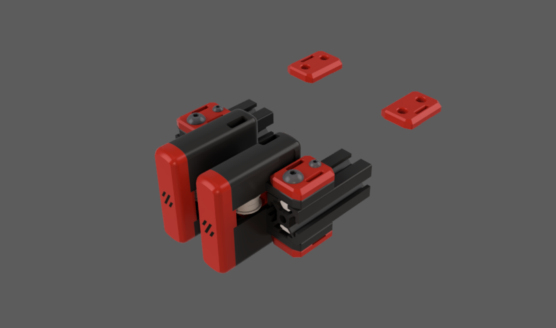
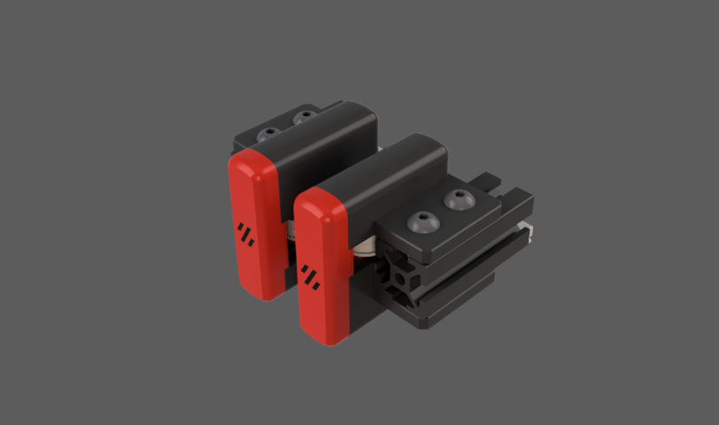

# SBFI (Smooth Beefy Front Idlers)

### What is this?

These are replacement front idlers for Vorons (and Voron-based machines).
This design is available for Voron Trident and Voron 2.4.

### Improvements?

This is a version remixed/based on [BFI](https://github.com/clee/VoronBFI/tree/main)
my version has several improvements or things that I have changed to fit my needs.
#### Changes:
- They are now symetrical
- They now have a magnetic cover so you don't need to see those screws anymore
- They now have curved edges instead of chamfers (very similar to [Ramalama2](https://github.com/Ramalama2/Voron-2-Mods/tree/main/Front_Idlers))

### Some more things you need to know:
All the clips for the z belts on the voron 2.4 are the exact same as the BFI

The internal bearing stack holder is also the exact same as the BFI (so if you had the BFI and you want to change to SBFI you don't need to reprint that part)

The front magnetic covers and be printed with MMU/AMS, you can print them as separate gcodes without removing the build plate after each print, or you can just print it with the negative of the voron logo (single color)

## BOM

### SBFI for Voron 2.4
(It's the exact same BOM as BFI but you also need 8 6x3mm magnets (4 per idler)

For V2.4, you'll need:
- 4× M5×30 BHCS 
- 4× M5 hex nuts
- 2× 5mm-diameter pin, 18mm long
- 2× M3 t-nuts
- 2× M3×16 BHCS

...plus the same shim/bearing stack setup for each idler as the original stock front idlers.

### SBFI for Trident
(It's the exact same BOM as BFI but you also need 8 6x3mm magnets (4 per idler) (and the exception that you need to change the M5x40 SHCS for M5x40 BHCS)

For Trident, you'll need:
- 4× M5×40 BHCS
- 4× M5 hex nuts
- 2× 5mm-diameter pin, 18mm long

...plus the same shim/bearing stack setup for each idler as the original stock front idlers.

# Contributos
I want to thank everyone who has helped to develop this project.

- [@clee](https://github.com/clee) (Original BFI)
- [@Ramalama2](https://github.com/Ramalama2) (Curved edges design)
- [@Shaly](https://github.com/Apstarkdev) (Improvement suggestions and testing)
- [@TheVoronModder](https://www.youtube.com/@TheVoronModder) (Improvement suggestions) (also check his [Chunky Alpaca Idlers](https://www.printables.com/model/678823-voron-24-trident-chunky-alpaca-tensioners))
- @Micky (Curved edges suggestion)

And If someone has any suggestion for improving the design or maybe some cool features I could add, please don't hesitate to tell me.

You can either contact me through Github or through Discord "radiotbo" (I'd probably answer you faster through discord)
